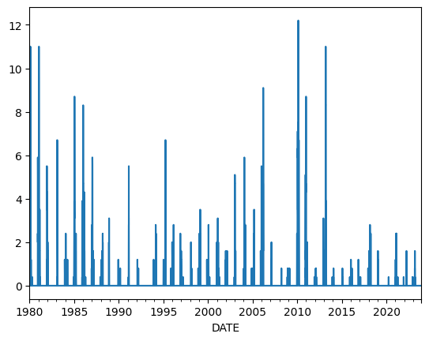
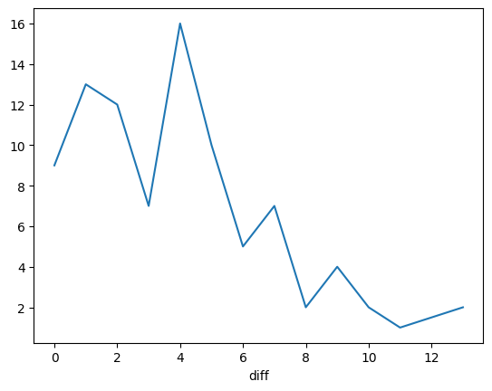

A machine learning model for Implementing a wheather Prediction machine.


```python
import pandas as pd

weather=pd.read_csv("w.csv",index_col="DATE")
```


```python
weather #each date gives the column a unique heading or we can say a primary key to every row 

```


<div>
<style scoped>
    .dataframe tbody tr th:only-of-type {
        vertical-align: middle;
    }

    .dataframe tbody tr th {
        vertical-align: top;
    }

    .dataframe thead th {
        text-align: right;
    }
</style>
<table border="1" class="dataframe">
  <thead>
    <tr style="text-align: right;">
      <th></th>
      <th>STATION</th>
      <th>NAME</th>
      <th>PRCP</th>
      <th>SNWD</th>
      <th>TAVG</th>
      <th>TMAX</th>
      <th>TMIN</th>
    </tr>
    <tr>
      <th>DATE</th>
      <th></th>
      <th></th>
      <th></th>
      <th></th>
      <th></th>
      <th></th>
      <th></th>
    </tr>
  </thead>
  <tbody>
    <tr>
      <th>1980-01-01</th>
      <td>GM000010147</td>
      <td>HAMBURG FUHLSBUETTEL, GM</td>
      <td>0.05</td>
      <td>0.4</td>
      <td>33.0</td>
      <td>35.0</td>
      <td>29.0</td>
    </tr>
    <tr>
      <th>1980-01-02</th>
      <td>GM000010147</td>
      <td>HAMBURG FUHLSBUETTEL, GM</td>
      <td>0.01</td>
      <td>0.8</td>
      <td>30.0</td>
      <td>33.0</td>
      <td>27.0</td>
    </tr>
    <tr>
      <th>1980-01-03</th>
      <td>GM000010147</td>
      <td>HAMBURG FUHLSBUETTEL, GM</td>
      <td>0.00</td>
      <td>0.4</td>
      <td>23.0</td>
      <td>30.0</td>
      <td>16.0</td>
    </tr>
    <tr>
      <th>1980-01-04</th>
      <td>GM000010147</td>
      <td>HAMBURG FUHLSBUETTEL, GM</td>
      <td>0.12</td>
      <td>0.4</td>
      <td>25.0</td>
      <td>31.0</td>
      <td>17.0</td>
    </tr>
    <tr>
      <th>1980-01-05</th>
      <td>GM000010147</td>
      <td>HAMBURG FUHLSBUETTEL, GM</td>
      <td>0.02</td>
      <td>1.2</td>
      <td>35.0</td>
      <td>37.0</td>
      <td>31.0</td>
    </tr>
    <tr>
      <th>...</th>
      <td>...</td>
      <td>...</td>
      <td>...</td>
      <td>...</td>
      <td>...</td>
      <td>...</td>
      <td>...</td>
    </tr>
    <tr>
      <th>2023-11-27</th>
      <td>GM000010147</td>
      <td>HAMBURG FUHLSBUETTEL, GM</td>
      <td>NaN</td>
      <td>NaN</td>
      <td>35.0</td>
      <td>NaN</td>
      <td>NaN</td>
    </tr>
    <tr>
      <th>2023-11-28</th>
      <td>GM000010147</td>
      <td>HAMBURG FUHLSBUETTEL, GM</td>
      <td>NaN</td>
      <td>NaN</td>
      <td>30.0</td>
      <td>NaN</td>
      <td>NaN</td>
    </tr>
    <tr>
      <th>2023-11-29</th>
      <td>GM000010147</td>
      <td>HAMBURG FUHLSBUETTEL, GM</td>
      <td>NaN</td>
      <td>NaN</td>
      <td>30.0</td>
      <td>NaN</td>
      <td>NaN</td>
    </tr>
    <tr>
      <th>2023-11-30</th>
      <td>GM000010147</td>
      <td>HAMBURG FUHLSBUETTEL, GM</td>
      <td>NaN</td>
      <td>NaN</td>
      <td>27.0</td>
      <td>NaN</td>
      <td>NaN</td>
    </tr>
    <tr>
      <th>2023-12-01</th>
      <td>GM000010147</td>
      <td>HAMBURG FUHLSBUETTEL, GM</td>
      <td>NaN</td>
      <td>NaN</td>
      <td>26.0</td>
      <td>NaN</td>
      <td>NaN</td>
    </tr>
  </tbody>
</table>
<p>16041 rows × 7 columns</p>
</div>


```python
## CLEANING DATA ##
```


```python
null_pct=weather.apply(pd.isnull).sum()/weather.shape[0] ##checking how many percent of each rows have null values
```


```python
null_pct #for exaample 27 percent of TAVG is ,missing. 

```


    STATION    0.000000
    NAME       0.000000
    PRCP       0.005985
    SNWD       0.006234
    TAVG       0.270370
    TMAX       0.005735
    TMIN       0.005735
    dtype: float64


```python
## next step we clean the data , and make our coloumn complete
```


```python
valid_columns=weather.columns[null_pct<.05] ##giving a condition for valid columns
```


```python
valid_columns
```


    Index(['STATION', 'NAME', 'PRCP', 'SNWD', 'TMAX', 'TMIN'], dtype='object')


```python
##all of our columns are okay and are in nice range, other wise we could have done weather =weather[valid_columns].copy()
```


```python
weather.columns=weather.columns.str.lower() ##making our clumns small case
```


```python
weather
```


<div>
<style scoped>
    .dataframe tbody tr th:only-of-type {
        vertical-align: middle;
    }

    .dataframe tbody tr th {
        vertical-align: top;
    }

    .dataframe thead th {
        text-align: right;
    }
</style>
<table border="1" class="dataframe">
  <thead>
    <tr style="text-align: right;">
      <th></th>
      <th>station</th>
      <th>name</th>
      <th>prcp</th>
      <th>snwd</th>
      <th>tavg</th>
      <th>tmax</th>
      <th>tmin</th>
    </tr>
    <tr>
      <th>DATE</th>
      <th></th>
      <th></th>
      <th></th>
      <th></th>
      <th></th>
      <th></th>
      <th></th>
    </tr>
  </thead>
  <tbody>
    <tr>
      <th>1980-01-01</th>
      <td>GM000010147</td>
      <td>HAMBURG FUHLSBUETTEL, GM</td>
      <td>0.05</td>
      <td>0.4</td>
      <td>33.0</td>
      <td>35.0</td>
      <td>29.0</td>
    </tr>
    <tr>
      <th>1980-01-02</th>
      <td>GM000010147</td>
      <td>HAMBURG FUHLSBUETTEL, GM</td>
      <td>0.01</td>
      <td>0.8</td>
      <td>30.0</td>
      <td>33.0</td>
      <td>27.0</td>
    </tr>
    <tr>
      <th>1980-01-03</th>
      <td>GM000010147</td>
      <td>HAMBURG FUHLSBUETTEL, GM</td>
      <td>0.00</td>
      <td>0.4</td>
      <td>23.0</td>
      <td>30.0</td>
      <td>16.0</td>
    </tr>
    <tr>
      <th>1980-01-04</th>
      <td>GM000010147</td>
      <td>HAMBURG FUHLSBUETTEL, GM</td>
      <td>0.12</td>
      <td>0.4</td>
      <td>25.0</td>
      <td>31.0</td>
      <td>17.0</td>
    </tr>
    <tr>
      <th>1980-01-05</th>
      <td>GM000010147</td>
      <td>HAMBURG FUHLSBUETTEL, GM</td>
      <td>0.02</td>
      <td>1.2</td>
      <td>35.0</td>
      <td>37.0</td>
      <td>31.0</td>
    </tr>
    <tr>
      <th>...</th>
      <td>...</td>
      <td>...</td>
      <td>...</td>
      <td>...</td>
      <td>...</td>
      <td>...</td>
      <td>...</td>
    </tr>
    <tr>
      <th>2023-11-27</th>
      <td>GM000010147</td>
      <td>HAMBURG FUHLSBUETTEL, GM</td>
      <td>NaN</td>
      <td>NaN</td>
      <td>35.0</td>
      <td>NaN</td>
      <td>NaN</td>
    </tr>
    <tr>
      <th>2023-11-28</th>
      <td>GM000010147</td>
      <td>HAMBURG FUHLSBUETTEL, GM</td>
      <td>NaN</td>
      <td>NaN</td>
      <td>30.0</td>
      <td>NaN</td>
      <td>NaN</td>
    </tr>
    <tr>
      <th>2023-11-29</th>
      <td>GM000010147</td>
      <td>HAMBURG FUHLSBUETTEL, GM</td>
      <td>NaN</td>
      <td>NaN</td>
      <td>30.0</td>
      <td>NaN</td>
      <td>NaN</td>
    </tr>
    <tr>
      <th>2023-11-30</th>
      <td>GM000010147</td>
      <td>HAMBURG FUHLSBUETTEL, GM</td>
      <td>NaN</td>
      <td>NaN</td>
      <td>27.0</td>
      <td>NaN</td>
      <td>NaN</td>
    </tr>
    <tr>
      <th>2023-12-01</th>
      <td>GM000010147</td>
      <td>HAMBURG FUHLSBUETTEL, GM</td>
      <td>NaN</td>
      <td>NaN</td>
      <td>26.0</td>
      <td>NaN</td>
      <td>NaN</td>
    </tr>
  </tbody>
</table>
<p>16041 rows × 7 columns</p>
</div>


```python
weather=weather.ffill()#auto fill the value as the last same value.
```


```python
weather.apply(pd.isnull).sum() #all values are filled now
```


    station    0
    name       0
    prcp       0
    snwd       0
    tavg       0
    tmax       0
    tmin       0
    dtype: int64


```python
## Correcting data types of given value ##
```


```python
weather.dtypes
#object means string , they are all correct so no changing required here as such.
```


    station     object
    name        object
    prcp       float64
    snwd       float64
    tavg       float64
    tmax       float64
    tmin       float64
    dtype: object


```python
weather.index #Checking if Index are stored correctly, 
```


    Index(['1980-01-01', '1980-01-02', '1980-01-03', '1980-01-04', '1980-01-05',
           '1980-01-06', '1980-01-07', '1980-01-08', '1980-01-09', '1980-01-10',
           ...
           '2023-11-22', '2023-11-23', '2023-11-24', '2023-11-25', '2023-11-26',
           '2023-11-27', '2023-11-28', '2023-11-29', '2023-11-30', '2023-12-01'],
          dtype='object', name='DATE', length=16041)


```python
weather.index = pd.to_datetime(weather.index )#our index is stored as an object but if we convert it to date format using to_date would be better later
```


```python
weather.index.year
```


    Index([1980, 1980, 1980, 1980, 1980, 1980, 1980, 1980, 1980, 1980,
           ...
           2023, 2023, 2023, 2023, 2023, 2023, 2023, 2023, 2023, 2023],
          dtype='int32', name='DATE', length=16041)


```python
## see now we can easily extract years for example from our index.
```


```python
weather["snwd"].plot() ##checking by a bar grpah snow in diff years , Attention for this you need matplotlib
```


    <Axes: xlabel='DATE'>


    

    


```python
weather["target"]  =weather.shift(-1)["tmax"] #we are creating onether coulumn target which will predict the tmax for tomm
```


```python
weather
```


<div>
<style scoped>
    .dataframe tbody tr th:only-of-type {
        vertical-align: middle;
    }

    .dataframe tbody tr th {
        vertical-align: top;
    }

    .dataframe thead th {
        text-align: right;
    }
</style>
<table border="1" class="dataframe">
  <thead>
    <tr style="text-align: right;">
      <th></th>
      <th>station</th>
      <th>name</th>
      <th>prcp</th>
      <th>snwd</th>
      <th>tavg</th>
      <th>tmax</th>
      <th>tmin</th>
      <th>target</th>
    </tr>
    <tr>
      <th>DATE</th>
      <th></th>
      <th></th>
      <th></th>
      <th></th>
      <th></th>
      <th></th>
      <th></th>
      <th></th>
    </tr>
  </thead>
  <tbody>
    <tr>
      <th>1980-01-01</th>
      <td>GM000010147</td>
      <td>HAMBURG FUHLSBUETTEL, GM</td>
      <td>0.05</td>
      <td>0.4</td>
      <td>33.0</td>
      <td>35.0</td>
      <td>29.0</td>
      <td>33.0</td>
    </tr>
    <tr>
      <th>1980-01-02</th>
      <td>GM000010147</td>
      <td>HAMBURG FUHLSBUETTEL, GM</td>
      <td>0.01</td>
      <td>0.8</td>
      <td>30.0</td>
      <td>33.0</td>
      <td>27.0</td>
      <td>30.0</td>
    </tr>
    <tr>
      <th>1980-01-03</th>
      <td>GM000010147</td>
      <td>HAMBURG FUHLSBUETTEL, GM</td>
      <td>0.00</td>
      <td>0.4</td>
      <td>23.0</td>
      <td>30.0</td>
      <td>16.0</td>
      <td>31.0</td>
    </tr>
    <tr>
      <th>1980-01-04</th>
      <td>GM000010147</td>
      <td>HAMBURG FUHLSBUETTEL, GM</td>
      <td>0.12</td>
      <td>0.4</td>
      <td>25.0</td>
      <td>31.0</td>
      <td>17.0</td>
      <td>37.0</td>
    </tr>
    <tr>
      <th>1980-01-05</th>
      <td>GM000010147</td>
      <td>HAMBURG FUHLSBUETTEL, GM</td>
      <td>0.02</td>
      <td>1.2</td>
      <td>35.0</td>
      <td>37.0</td>
      <td>31.0</td>
      <td>36.0</td>
    </tr>
    <tr>
      <th>...</th>
      <td>...</td>
      <td>...</td>
      <td>...</td>
      <td>...</td>
      <td>...</td>
      <td>...</td>
      <td>...</td>
      <td>...</td>
    </tr>
    <tr>
      <th>2023-11-27</th>
      <td>GM000010147</td>
      <td>HAMBURG FUHLSBUETTEL, GM</td>
      <td>0.01</td>
      <td>0.0</td>
      <td>35.0</td>
      <td>64.0</td>
      <td>51.0</td>
      <td>64.0</td>
    </tr>
    <tr>
      <th>2023-11-28</th>
      <td>GM000010147</td>
      <td>HAMBURG FUHLSBUETTEL, GM</td>
      <td>0.01</td>
      <td>0.0</td>
      <td>30.0</td>
      <td>64.0</td>
      <td>51.0</td>
      <td>64.0</td>
    </tr>
    <tr>
      <th>2023-11-29</th>
      <td>GM000010147</td>
      <td>HAMBURG FUHLSBUETTEL, GM</td>
      <td>0.01</td>
      <td>0.0</td>
      <td>30.0</td>
      <td>64.0</td>
      <td>51.0</td>
      <td>64.0</td>
    </tr>
    <tr>
      <th>2023-11-30</th>
      <td>GM000010147</td>
      <td>HAMBURG FUHLSBUETTEL, GM</td>
      <td>0.01</td>
      <td>0.0</td>
      <td>27.0</td>
      <td>64.0</td>
      <td>51.0</td>
      <td>64.0</td>
    </tr>
    <tr>
      <th>2023-12-01</th>
      <td>GM000010147</td>
      <td>HAMBURG FUHLSBUETTEL, GM</td>
      <td>0.01</td>
      <td>0.0</td>
      <td>26.0</td>
      <td>64.0</td>
      <td>51.0</td>
      <td>NaN</td>
    </tr>
  </tbody>
</table>
<p>16041 rows × 8 columns</p>
</div>


```python
weather.ffill()#rn we dont have data for last value, so we are gonna do ffill again to make sure we have a full data set , it is incorrect but we have 16k rows with correct data 
```


<div>
<style scoped>
    .dataframe tbody tr th:only-of-type {
        vertical-align: middle;
    }

    .dataframe tbody tr th {
        vertical-align: top;
    }

    .dataframe thead th {
        text-align: right;
    }
</style>
<table border="1" class="dataframe">
  <thead>
    <tr style="text-align: right;">
      <th></th>
      <th>station</th>
      <th>name</th>
      <th>prcp</th>
      <th>snwd</th>
      <th>tavg</th>
      <th>tmax</th>
      <th>tmin</th>
      <th>target</th>
    </tr>
    <tr>
      <th>DATE</th>
      <th></th>
      <th></th>
      <th></th>
      <th></th>
      <th></th>
      <th></th>
      <th></th>
      <th></th>
    </tr>
  </thead>
  <tbody>
    <tr>
      <th>1980-01-01</th>
      <td>GM000010147</td>
      <td>HAMBURG FUHLSBUETTEL, GM</td>
      <td>0.05</td>
      <td>0.4</td>
      <td>33.0</td>
      <td>35.0</td>
      <td>29.0</td>
      <td>33.0</td>
    </tr>
    <tr>
      <th>1980-01-02</th>
      <td>GM000010147</td>
      <td>HAMBURG FUHLSBUETTEL, GM</td>
      <td>0.01</td>
      <td>0.8</td>
      <td>30.0</td>
      <td>33.0</td>
      <td>27.0</td>
      <td>30.0</td>
    </tr>
    <tr>
      <th>1980-01-03</th>
      <td>GM000010147</td>
      <td>HAMBURG FUHLSBUETTEL, GM</td>
      <td>0.00</td>
      <td>0.4</td>
      <td>23.0</td>
      <td>30.0</td>
      <td>16.0</td>
      <td>31.0</td>
    </tr>
    <tr>
      <th>1980-01-04</th>
      <td>GM000010147</td>
      <td>HAMBURG FUHLSBUETTEL, GM</td>
      <td>0.12</td>
      <td>0.4</td>
      <td>25.0</td>
      <td>31.0</td>
      <td>17.0</td>
      <td>37.0</td>
    </tr>
    <tr>
      <th>1980-01-05</th>
      <td>GM000010147</td>
      <td>HAMBURG FUHLSBUETTEL, GM</td>
      <td>0.02</td>
      <td>1.2</td>
      <td>35.0</td>
      <td>37.0</td>
      <td>31.0</td>
      <td>36.0</td>
    </tr>
    <tr>
      <th>...</th>
      <td>...</td>
      <td>...</td>
      <td>...</td>
      <td>...</td>
      <td>...</td>
      <td>...</td>
      <td>...</td>
      <td>...</td>
    </tr>
    <tr>
      <th>2023-11-27</th>
      <td>GM000010147</td>
      <td>HAMBURG FUHLSBUETTEL, GM</td>
      <td>0.01</td>
      <td>0.0</td>
      <td>35.0</td>
      <td>64.0</td>
      <td>51.0</td>
      <td>64.0</td>
    </tr>
    <tr>
      <th>2023-11-28</th>
      <td>GM000010147</td>
      <td>HAMBURG FUHLSBUETTEL, GM</td>
      <td>0.01</td>
      <td>0.0</td>
      <td>30.0</td>
      <td>64.0</td>
      <td>51.0</td>
      <td>64.0</td>
    </tr>
    <tr>
      <th>2023-11-29</th>
      <td>GM000010147</td>
      <td>HAMBURG FUHLSBUETTEL, GM</td>
      <td>0.01</td>
      <td>0.0</td>
      <td>30.0</td>
      <td>64.0</td>
      <td>51.0</td>
      <td>64.0</td>
    </tr>
    <tr>
      <th>2023-11-30</th>
      <td>GM000010147</td>
      <td>HAMBURG FUHLSBUETTEL, GM</td>
      <td>0.01</td>
      <td>0.0</td>
      <td>27.0</td>
      <td>64.0</td>
      <td>51.0</td>
      <td>64.0</td>
    </tr>
    <tr>
      <th>2023-12-01</th>
      <td>GM000010147</td>
      <td>HAMBURG FUHLSBUETTEL, GM</td>
      <td>0.01</td>
      <td>0.0</td>
      <td>26.0</td>
      <td>64.0</td>
      <td>51.0</td>
      <td>64.0</td>
    </tr>
  </tbody>
</table>
<p>16041 rows × 8 columns</p>
</div>


```python
from sklearn.linear_model import Ridge  #applying ridge regression model
rr=Ridge(alpha=.1) ##default wfor collinearity
```


```python
predictors=weather.columns[~weather.columns.isin(["target","name","station"])] #we are predciting every column except the column target ,name ,station ,as they remain same.
```


```python
predictors #checking if we have all important columns only 

```


    Index(['prcp', 'snwd', 'tavg', 'tmax', 'tmin'], dtype='object')


```python
#applying a model using backtest 
def backtest(weather,model,predictors,start=3650 ,step =90): ##using backtest function to predict now, we are starting after furst 10 year for data set ,cuz thy serve as base data. and we are making prediction for every 90 days one go
    all_predictions =[]  

    for i in range(start,weather.shape[0],step):
        train=weather.iloc[:i,:] #our training set, all rows until the current row
        test = weather.iloc[i:(i+step),:] #test set of next 90 days

        model.fit(train[predictors],train["target"]) #fitting out model in the Predicting mechanism

        preds=model.predict(test[predictors])  #usually a return numparray 
  ##making it a series
        preds=pd.Series(preds,index=test.index) #index is same as test data
        combined=pd.concat([test["target"],preds],axis=1) ##concat using pandas concat method, concatting with target , axis =1 is made to treat every column as a seprate one
        combined.columns=["actual","predictions"] #naming columns actual and our predictions
        combined["diff"]=(combined["predictions"]-combined["actual"]).abs() #seeing how much deviation is there in absolute value 
        all_predictions.append(combined) #add all predictions 
        ##so each time we go thru this loop we make predictions for 90 days and then at very end we concat all the prediction togther in a very big data frame.
        return pd.concat(all_predictions,axis =0) #its default so  you can also ignore it , but it means treat every row as seperate 
```


```python
##                     making predictions                   ##
```


```python
predictions = backtest(weather,rr,predictors)
```


```python
predictions ##first 10 years are skipped as we use them for our base data set models
```


<div>
<style scoped>
    .dataframe tbody tr th:only-of-type {
        vertical-align: middle;
    }

    .dataframe tbody tr th {
        vertical-align: top;
    }

    .dataframe thead th {
        text-align: right;
    }
</style>
<table border="1" class="dataframe">
  <thead>
    <tr style="text-align: right;">
      <th></th>
      <th>actual</th>
      <th>predictions</th>
      <th>diff</th>
    </tr>
    <tr>
      <th>DATE</th>
      <th></th>
      <th></th>
      <th></th>
    </tr>
  </thead>
  <tbody>
    <tr>
      <th>1989-12-29</th>
      <td>30.0</td>
      <td>31.100905</td>
      <td>1.100905</td>
    </tr>
    <tr>
      <th>1989-12-30</th>
      <td>31.0</td>
      <td>33.194554</td>
      <td>2.194554</td>
    </tr>
    <tr>
      <th>1989-12-31</th>
      <td>34.0</td>
      <td>33.784868</td>
      <td>0.215132</td>
    </tr>
    <tr>
      <th>1990-01-01</th>
      <td>31.0</td>
      <td>33.911823</td>
      <td>2.911823</td>
    </tr>
    <tr>
      <th>1990-01-02</th>
      <td>33.0</td>
      <td>32.678747</td>
      <td>0.321253</td>
    </tr>
    <tr>
      <th>...</th>
      <td>...</td>
      <td>...</td>
      <td>...</td>
    </tr>
    <tr>
      <th>1990-03-24</th>
      <td>45.0</td>
      <td>52.232840</td>
      <td>7.232840</td>
    </tr>
    <tr>
      <th>1990-03-25</th>
      <td>47.0</td>
      <td>45.021255</td>
      <td>1.978745</td>
    </tr>
    <tr>
      <th>1990-03-26</th>
      <td>49.0</td>
      <td>47.232421</td>
      <td>1.767579</td>
    </tr>
    <tr>
      <th>1990-03-27</th>
      <td>49.0</td>
      <td>48.755131</td>
      <td>0.244869</td>
    </tr>
    <tr>
      <th>1990-03-28</th>
      <td>54.0</td>
      <td>48.755131</td>
      <td>5.244869</td>
    </tr>
  </tbody>
</table>
<p>90 rows × 3 columns</p>
</div>


```python
## now our deviations is not that accuurate and elegant lets make a model to re check and recalculate our deviations deeply.
```


```python
from sklearn.metrics import mean_absolute_error
## this method takes out a avg using all the values in diff column ##
mean_absolute_error(predictions["actual"],predictions["predictions"])
```


    3.395357183959724


```python
#or you can also just get a mean() , shoulde be the same value using just onather ,method.
predictions["diff"].mean()
```


    3.395357183959724


Trying to Improve our Accuracy now.


```python
def pct_diff(old, new):
    return (new - old) / old

def compute_rolling(weather, horizon, col):
    label = f"rolling_{horizon}_{col}"
    weather[label] = weather[col].rolling(horizon).mean()
    weather[f"{label}_pct"] = pct_diff(weather[label], weather[col])
    return weather
    
rolling_horizons = [3, 14]
for horizon in rolling_horizons:
    for col in ["tmax", "tmin", "prcp"]:
        weather = compute_rolling(weather, horizon, col)
```


```python
weather
```


<div>
<style scoped>
    .dataframe tbody tr th:only-of-type {
        vertical-align: middle;
    }

    .dataframe tbody tr th {
        vertical-align: top;
    }

    .dataframe thead th {
        text-align: right;
    }
</style>
<table border="1" class="dataframe">
  <thead>
    <tr style="text-align: right;">
      <th></th>
      <th>station</th>
      <th>name</th>
      <th>prcp</th>
      <th>snwd</th>
      <th>tavg</th>
      <th>tmax</th>
      <th>tmin</th>
      <th>target</th>
      <th>rolling_3_tmax</th>
      <th>rolling_3_tmax_pct</th>
      <th>rolling_3_tmin</th>
      <th>rolling_3_tmin_pct</th>
      <th>rolling_3_prcp</th>
      <th>rolling_3_prcp_pct</th>
      <th>rolling_14_tmax</th>
      <th>rolling_14_tmax_pct</th>
      <th>rolling_14_tmin</th>
      <th>rolling_14_tmin_pct</th>
      <th>rolling_14_prcp</th>
      <th>rolling_14_prcp_pct</th>
    </tr>
    <tr>
      <th>DATE</th>
      <th></th>
      <th></th>
      <th></th>
      <th></th>
      <th></th>
      <th></th>
      <th></th>
      <th></th>
      <th></th>
      <th></th>
      <th></th>
      <th></th>
      <th></th>
      <th></th>
      <th></th>
      <th></th>
      <th></th>
      <th></th>
      <th></th>
      <th></th>
    </tr>
  </thead>
  <tbody>
    <tr>
      <th>1980-01-01</th>
      <td>GM000010147</td>
      <td>HAMBURG FUHLSBUETTEL, GM</td>
      <td>0.05</td>
      <td>0.4</td>
      <td>33.0</td>
      <td>35.0</td>
      <td>29.0</td>
      <td>33.0</td>
      <td>NaN</td>
      <td>NaN</td>
      <td>NaN</td>
      <td>NaN</td>
      <td>NaN</td>
      <td>NaN</td>
      <td>NaN</td>
      <td>NaN</td>
      <td>NaN</td>
      <td>NaN</td>
      <td>NaN</td>
      <td>NaN</td>
    </tr>
    <tr>
      <th>1980-01-02</th>
      <td>GM000010147</td>
      <td>HAMBURG FUHLSBUETTEL, GM</td>
      <td>0.01</td>
      <td>0.8</td>
      <td>30.0</td>
      <td>33.0</td>
      <td>27.0</td>
      <td>30.0</td>
      <td>NaN</td>
      <td>NaN</td>
      <td>NaN</td>
      <td>NaN</td>
      <td>NaN</td>
      <td>NaN</td>
      <td>NaN</td>
      <td>NaN</td>
      <td>NaN</td>
      <td>NaN</td>
      <td>NaN</td>
      <td>NaN</td>
    </tr>
    <tr>
      <th>1980-01-03</th>
      <td>GM000010147</td>
      <td>HAMBURG FUHLSBUETTEL, GM</td>
      <td>0.00</td>
      <td>0.4</td>
      <td>23.0</td>
      <td>30.0</td>
      <td>16.0</td>
      <td>31.0</td>
      <td>32.666667</td>
      <td>-0.081633</td>
      <td>24.000000</td>
      <td>-0.333333</td>
      <td>0.020000</td>
      <td>-1.000000</td>
      <td>NaN</td>
      <td>NaN</td>
      <td>NaN</td>
      <td>NaN</td>
      <td>NaN</td>
      <td>NaN</td>
    </tr>
    <tr>
      <th>1980-01-04</th>
      <td>GM000010147</td>
      <td>HAMBURG FUHLSBUETTEL, GM</td>
      <td>0.12</td>
      <td>0.4</td>
      <td>25.0</td>
      <td>31.0</td>
      <td>17.0</td>
      <td>37.0</td>
      <td>31.333333</td>
      <td>-0.010638</td>
      <td>20.000000</td>
      <td>-0.150000</td>
      <td>0.043333</td>
      <td>1.769231</td>
      <td>NaN</td>
      <td>NaN</td>
      <td>NaN</td>
      <td>NaN</td>
      <td>NaN</td>
      <td>NaN</td>
    </tr>
    <tr>
      <th>1980-01-05</th>
      <td>GM000010147</td>
      <td>HAMBURG FUHLSBUETTEL, GM</td>
      <td>0.02</td>
      <td>1.2</td>
      <td>35.0</td>
      <td>37.0</td>
      <td>31.0</td>
      <td>36.0</td>
      <td>32.666667</td>
      <td>0.132653</td>
      <td>21.333333</td>
      <td>0.453125</td>
      <td>0.046667</td>
      <td>-0.571429</td>
      <td>NaN</td>
      <td>NaN</td>
      <td>NaN</td>
      <td>NaN</td>
      <td>NaN</td>
      <td>NaN</td>
    </tr>
    <tr>
      <th>...</th>
      <td>...</td>
      <td>...</td>
      <td>...</td>
      <td>...</td>
      <td>...</td>
      <td>...</td>
      <td>...</td>
      <td>...</td>
      <td>...</td>
      <td>...</td>
      <td>...</td>
      <td>...</td>
      <td>...</td>
      <td>...</td>
      <td>...</td>
      <td>...</td>
      <td>...</td>
      <td>...</td>
      <td>...</td>
      <td>...</td>
    </tr>
    <tr>
      <th>2023-11-27</th>
      <td>GM000010147</td>
      <td>HAMBURG FUHLSBUETTEL, GM</td>
      <td>0.01</td>
      <td>0.0</td>
      <td>35.0</td>
      <td>64.0</td>
      <td>51.0</td>
      <td>64.0</td>
      <td>64.000000</td>
      <td>0.000000</td>
      <td>51.000000</td>
      <td>0.000000</td>
      <td>0.010000</td>
      <td>0.000000</td>
      <td>64.0</td>
      <td>0.0</td>
      <td>51.0</td>
      <td>0.0</td>
      <td>0.01</td>
      <td>0.0</td>
    </tr>
    <tr>
      <th>2023-11-28</th>
      <td>GM000010147</td>
      <td>HAMBURG FUHLSBUETTEL, GM</td>
      <td>0.01</td>
      <td>0.0</td>
      <td>30.0</td>
      <td>64.0</td>
      <td>51.0</td>
      <td>64.0</td>
      <td>64.000000</td>
      <td>0.000000</td>
      <td>51.000000</td>
      <td>0.000000</td>
      <td>0.010000</td>
      <td>0.000000</td>
      <td>64.0</td>
      <td>0.0</td>
      <td>51.0</td>
      <td>0.0</td>
      <td>0.01</td>
      <td>0.0</td>
    </tr>
    <tr>
      <th>2023-11-29</th>
      <td>GM000010147</td>
      <td>HAMBURG FUHLSBUETTEL, GM</td>
      <td>0.01</td>
      <td>0.0</td>
      <td>30.0</td>
      <td>64.0</td>
      <td>51.0</td>
      <td>64.0</td>
      <td>64.000000</td>
      <td>0.000000</td>
      <td>51.000000</td>
      <td>0.000000</td>
      <td>0.010000</td>
      <td>0.000000</td>
      <td>64.0</td>
      <td>0.0</td>
      <td>51.0</td>
      <td>0.0</td>
      <td>0.01</td>
      <td>0.0</td>
    </tr>
    <tr>
      <th>2023-11-30</th>
      <td>GM000010147</td>
      <td>HAMBURG FUHLSBUETTEL, GM</td>
      <td>0.01</td>
      <td>0.0</td>
      <td>27.0</td>
      <td>64.0</td>
      <td>51.0</td>
      <td>64.0</td>
      <td>64.000000</td>
      <td>0.000000</td>
      <td>51.000000</td>
      <td>0.000000</td>
      <td>0.010000</td>
      <td>0.000000</td>
      <td>64.0</td>
      <td>0.0</td>
      <td>51.0</td>
      <td>0.0</td>
      <td>0.01</td>
      <td>0.0</td>
    </tr>
    <tr>
      <th>2023-12-01</th>
      <td>GM000010147</td>
      <td>HAMBURG FUHLSBUETTEL, GM</td>
      <td>0.01</td>
      <td>0.0</td>
      <td>26.0</td>
      <td>64.0</td>
      <td>51.0</td>
      <td>NaN</td>
      <td>64.000000</td>
      <td>0.000000</td>
      <td>51.000000</td>
      <td>0.000000</td>
      <td>0.010000</td>
      <td>0.000000</td>
      <td>64.0</td>
      <td>0.0</td>
      <td>51.0</td>
      <td>0.0</td>
      <td>0.01</td>
      <td>0.0</td>
    </tr>
  </tbody>
</table>
<p>16041 rows × 20 columns</p>
</div>


```python
#first 14 days are missing as ecpected
```


```python
weather =weather.iloc[14:,: ]##removing first 14
```


```python
weather #still few values missing as we are dividing by zero.
```


<div>
<style scoped>
    .dataframe tbody tr th:only-of-type {
        vertical-align: middle;
    }

    .dataframe tbody tr th {
        vertical-align: top;
    }

    .dataframe thead th {
        text-align: right;
    }
</style>
<table border="1" class="dataframe">
  <thead>
    <tr style="text-align: right;">
      <th></th>
      <th>station</th>
      <th>name</th>
      <th>prcp</th>
      <th>snwd</th>
      <th>tavg</th>
      <th>tmax</th>
      <th>tmin</th>
      <th>target</th>
      <th>rolling_3_tmax</th>
      <th>rolling_3_tmax_pct</th>
      <th>rolling_3_tmin</th>
      <th>rolling_3_tmin_pct</th>
      <th>rolling_3_prcp</th>
      <th>rolling_3_prcp_pct</th>
      <th>rolling_14_tmax</th>
      <th>rolling_14_tmax_pct</th>
      <th>rolling_14_tmin</th>
      <th>rolling_14_tmin_pct</th>
      <th>rolling_14_prcp</th>
      <th>rolling_14_prcp_pct</th>
    </tr>
    <tr>
      <th>DATE</th>
      <th></th>
      <th></th>
      <th></th>
      <th></th>
      <th></th>
      <th></th>
      <th></th>
      <th></th>
      <th></th>
      <th></th>
      <th></th>
      <th></th>
      <th></th>
      <th></th>
      <th></th>
      <th></th>
      <th></th>
      <th></th>
      <th></th>
      <th></th>
    </tr>
  </thead>
  <tbody>
    <tr>
      <th>1980-01-01</th>
      <td>GM000010147</td>
      <td>HAMBURG FUHLSBUETTEL, GM</td>
      <td>0.05</td>
      <td>0.4</td>
      <td>33.0</td>
      <td>35.0</td>
      <td>29.0</td>
      <td>33.0</td>
      <td>NaN</td>
      <td>NaN</td>
      <td>NaN</td>
      <td>NaN</td>
      <td>NaN</td>
      <td>NaN</td>
      <td>NaN</td>
      <td>NaN</td>
      <td>NaN</td>
      <td>NaN</td>
      <td>NaN</td>
      <td>NaN</td>
    </tr>
    <tr>
      <th>1980-01-02</th>
      <td>GM000010147</td>
      <td>HAMBURG FUHLSBUETTEL, GM</td>
      <td>0.01</td>
      <td>0.8</td>
      <td>30.0</td>
      <td>33.0</td>
      <td>27.0</td>
      <td>30.0</td>
      <td>NaN</td>
      <td>NaN</td>
      <td>NaN</td>
      <td>NaN</td>
      <td>NaN</td>
      <td>NaN</td>
      <td>NaN</td>
      <td>NaN</td>
      <td>NaN</td>
      <td>NaN</td>
      <td>NaN</td>
      <td>NaN</td>
    </tr>
    <tr>
      <th>1980-01-03</th>
      <td>GM000010147</td>
      <td>HAMBURG FUHLSBUETTEL, GM</td>
      <td>0.00</td>
      <td>0.4</td>
      <td>23.0</td>
      <td>30.0</td>
      <td>16.0</td>
      <td>31.0</td>
      <td>32.666667</td>
      <td>-0.081633</td>
      <td>24.000000</td>
      <td>-0.333333</td>
      <td>0.020000</td>
      <td>-1.000000</td>
      <td>NaN</td>
      <td>NaN</td>
      <td>NaN</td>
      <td>NaN</td>
      <td>NaN</td>
      <td>NaN</td>
    </tr>
    <tr>
      <th>1980-01-04</th>
      <td>GM000010147</td>
      <td>HAMBURG FUHLSBUETTEL, GM</td>
      <td>0.12</td>
      <td>0.4</td>
      <td>25.0</td>
      <td>31.0</td>
      <td>17.0</td>
      <td>37.0</td>
      <td>31.333333</td>
      <td>-0.010638</td>
      <td>20.000000</td>
      <td>-0.150000</td>
      <td>0.043333</td>
      <td>1.769231</td>
      <td>NaN</td>
      <td>NaN</td>
      <td>NaN</td>
      <td>NaN</td>
      <td>NaN</td>
      <td>NaN</td>
    </tr>
    <tr>
      <th>1980-01-05</th>
      <td>GM000010147</td>
      <td>HAMBURG FUHLSBUETTEL, GM</td>
      <td>0.02</td>
      <td>1.2</td>
      <td>35.0</td>
      <td>37.0</td>
      <td>31.0</td>
      <td>36.0</td>
      <td>32.666667</td>
      <td>0.132653</td>
      <td>21.333333</td>
      <td>0.453125</td>
      <td>0.046667</td>
      <td>-0.571429</td>
      <td>NaN</td>
      <td>NaN</td>
      <td>NaN</td>
      <td>NaN</td>
      <td>NaN</td>
      <td>NaN</td>
    </tr>
    <tr>
      <th>...</th>
      <td>...</td>
      <td>...</td>
      <td>...</td>
      <td>...</td>
      <td>...</td>
      <td>...</td>
      <td>...</td>
      <td>...</td>
      <td>...</td>
      <td>...</td>
      <td>...</td>
      <td>...</td>
      <td>...</td>
      <td>...</td>
      <td>...</td>
      <td>...</td>
      <td>...</td>
      <td>...</td>
      <td>...</td>
      <td>...</td>
    </tr>
    <tr>
      <th>2023-11-27</th>
      <td>GM000010147</td>
      <td>HAMBURG FUHLSBUETTEL, GM</td>
      <td>0.01</td>
      <td>0.0</td>
      <td>35.0</td>
      <td>64.0</td>
      <td>51.0</td>
      <td>64.0</td>
      <td>64.000000</td>
      <td>0.000000</td>
      <td>51.000000</td>
      <td>0.000000</td>
      <td>0.010000</td>
      <td>0.000000</td>
      <td>64.0</td>
      <td>0.0</td>
      <td>51.0</td>
      <td>0.0</td>
      <td>0.01</td>
      <td>0.0</td>
    </tr>
    <tr>
      <th>2023-11-28</th>
      <td>GM000010147</td>
      <td>HAMBURG FUHLSBUETTEL, GM</td>
      <td>0.01</td>
      <td>0.0</td>
      <td>30.0</td>
      <td>64.0</td>
      <td>51.0</td>
      <td>64.0</td>
      <td>64.000000</td>
      <td>0.000000</td>
      <td>51.000000</td>
      <td>0.000000</td>
      <td>0.010000</td>
      <td>0.000000</td>
      <td>64.0</td>
      <td>0.0</td>
      <td>51.0</td>
      <td>0.0</td>
      <td>0.01</td>
      <td>0.0</td>
    </tr>
    <tr>
      <th>2023-11-29</th>
      <td>GM000010147</td>
      <td>HAMBURG FUHLSBUETTEL, GM</td>
      <td>0.01</td>
      <td>0.0</td>
      <td>30.0</td>
      <td>64.0</td>
      <td>51.0</td>
      <td>64.0</td>
      <td>64.000000</td>
      <td>0.000000</td>
      <td>51.000000</td>
      <td>0.000000</td>
      <td>0.010000</td>
      <td>0.000000</td>
      <td>64.0</td>
      <td>0.0</td>
      <td>51.0</td>
      <td>0.0</td>
      <td>0.01</td>
      <td>0.0</td>
    </tr>
    <tr>
      <th>2023-11-30</th>
      <td>GM000010147</td>
      <td>HAMBURG FUHLSBUETTEL, GM</td>
      <td>0.01</td>
      <td>0.0</td>
      <td>27.0</td>
      <td>64.0</td>
      <td>51.0</td>
      <td>64.0</td>
      <td>64.000000</td>
      <td>0.000000</td>
      <td>51.000000</td>
      <td>0.000000</td>
      <td>0.010000</td>
      <td>0.000000</td>
      <td>64.0</td>
      <td>0.0</td>
      <td>51.0</td>
      <td>0.0</td>
      <td>0.01</td>
      <td>0.0</td>
    </tr>
    <tr>
      <th>2023-12-01</th>
      <td>GM000010147</td>
      <td>HAMBURG FUHLSBUETTEL, GM</td>
      <td>0.01</td>
      <td>0.0</td>
      <td>26.0</td>
      <td>64.0</td>
      <td>51.0</td>
      <td>NaN</td>
      <td>64.000000</td>
      <td>0.000000</td>
      <td>51.000000</td>
      <td>0.000000</td>
      <td>0.010000</td>
      <td>0.000000</td>
      <td>64.0</td>
      <td>0.0</td>
      <td>51.0</td>
      <td>0.0</td>
      <td>0.01</td>
      <td>0.0</td>
    </tr>
  </tbody>
</table>
<p>16041 rows × 20 columns</p>
</div>


```python
weather=weather.fillna(0) #removing nan and replacing with zeros.
```


```python
weather
```


<div>
<style scoped>
    .dataframe tbody tr th:only-of-type {
        vertical-align: middle;
    }

    .dataframe tbody tr th {
        vertical-align: top;
    }

    .dataframe thead th {
        text-align: right;
    }
</style>
<table border="1" class="dataframe">
  <thead>
    <tr style="text-align: right;">
      <th></th>
      <th>station</th>
      <th>name</th>
      <th>prcp</th>
      <th>snwd</th>
      <th>tavg</th>
      <th>tmax</th>
      <th>tmin</th>
      <th>target</th>
      <th>rolling_3_tmax</th>
      <th>rolling_3_tmax_pct</th>
      <th>rolling_3_tmin</th>
      <th>rolling_3_tmin_pct</th>
      <th>rolling_3_prcp</th>
      <th>rolling_3_prcp_pct</th>
      <th>rolling_14_tmax</th>
      <th>rolling_14_tmax_pct</th>
      <th>rolling_14_tmin</th>
      <th>rolling_14_tmin_pct</th>
      <th>rolling_14_prcp</th>
      <th>rolling_14_prcp_pct</th>
    </tr>
    <tr>
      <th>DATE</th>
      <th></th>
      <th></th>
      <th></th>
      <th></th>
      <th></th>
      <th></th>
      <th></th>
      <th></th>
      <th></th>
      <th></th>
      <th></th>
      <th></th>
      <th></th>
      <th></th>
      <th></th>
      <th></th>
      <th></th>
      <th></th>
      <th></th>
      <th></th>
    </tr>
  </thead>
  <tbody>
    <tr>
      <th>1980-01-01</th>
      <td>GM000010147</td>
      <td>HAMBURG FUHLSBUETTEL, GM</td>
      <td>0.05</td>
      <td>0.4</td>
      <td>33.0</td>
      <td>35.0</td>
      <td>29.0</td>
      <td>33.0</td>
      <td>0.000000</td>
      <td>0.000000</td>
      <td>0.000000</td>
      <td>0.000000</td>
      <td>0.000000</td>
      <td>0.000000</td>
      <td>0.0</td>
      <td>0.0</td>
      <td>0.0</td>
      <td>0.0</td>
      <td>0.00</td>
      <td>0.0</td>
    </tr>
    <tr>
      <th>1980-01-02</th>
      <td>GM000010147</td>
      <td>HAMBURG FUHLSBUETTEL, GM</td>
      <td>0.01</td>
      <td>0.8</td>
      <td>30.0</td>
      <td>33.0</td>
      <td>27.0</td>
      <td>30.0</td>
      <td>0.000000</td>
      <td>0.000000</td>
      <td>0.000000</td>
      <td>0.000000</td>
      <td>0.000000</td>
      <td>0.000000</td>
      <td>0.0</td>
      <td>0.0</td>
      <td>0.0</td>
      <td>0.0</td>
      <td>0.00</td>
      <td>0.0</td>
    </tr>
    <tr>
      <th>1980-01-03</th>
      <td>GM000010147</td>
      <td>HAMBURG FUHLSBUETTEL, GM</td>
      <td>0.00</td>
      <td>0.4</td>
      <td>23.0</td>
      <td>30.0</td>
      <td>16.0</td>
      <td>31.0</td>
      <td>32.666667</td>
      <td>-0.081633</td>
      <td>24.000000</td>
      <td>-0.333333</td>
      <td>0.020000</td>
      <td>-1.000000</td>
      <td>0.0</td>
      <td>0.0</td>
      <td>0.0</td>
      <td>0.0</td>
      <td>0.00</td>
      <td>0.0</td>
    </tr>
    <tr>
      <th>1980-01-04</th>
      <td>GM000010147</td>
      <td>HAMBURG FUHLSBUETTEL, GM</td>
      <td>0.12</td>
      <td>0.4</td>
      <td>25.0</td>
      <td>31.0</td>
      <td>17.0</td>
      <td>37.0</td>
      <td>31.333333</td>
      <td>-0.010638</td>
      <td>20.000000</td>
      <td>-0.150000</td>
      <td>0.043333</td>
      <td>1.769231</td>
      <td>0.0</td>
      <td>0.0</td>
      <td>0.0</td>
      <td>0.0</td>
      <td>0.00</td>
      <td>0.0</td>
    </tr>
    <tr>
      <th>1980-01-05</th>
      <td>GM000010147</td>
      <td>HAMBURG FUHLSBUETTEL, GM</td>
      <td>0.02</td>
      <td>1.2</td>
      <td>35.0</td>
      <td>37.0</td>
      <td>31.0</td>
      <td>36.0</td>
      <td>32.666667</td>
      <td>0.132653</td>
      <td>21.333333</td>
      <td>0.453125</td>
      <td>0.046667</td>
      <td>-0.571429</td>
      <td>0.0</td>
      <td>0.0</td>
      <td>0.0</td>
      <td>0.0</td>
      <td>0.00</td>
      <td>0.0</td>
    </tr>
    <tr>
      <th>...</th>
      <td>...</td>
      <td>...</td>
      <td>...</td>
      <td>...</td>
      <td>...</td>
      <td>...</td>
      <td>...</td>
      <td>...</td>
      <td>...</td>
      <td>...</td>
      <td>...</td>
      <td>...</td>
      <td>...</td>
      <td>...</td>
      <td>...</td>
      <td>...</td>
      <td>...</td>
      <td>...</td>
      <td>...</td>
      <td>...</td>
    </tr>
    <tr>
      <th>2023-11-27</th>
      <td>GM000010147</td>
      <td>HAMBURG FUHLSBUETTEL, GM</td>
      <td>0.01</td>
      <td>0.0</td>
      <td>35.0</td>
      <td>64.0</td>
      <td>51.0</td>
      <td>64.0</td>
      <td>64.000000</td>
      <td>0.000000</td>
      <td>51.000000</td>
      <td>0.000000</td>
      <td>0.010000</td>
      <td>0.000000</td>
      <td>64.0</td>
      <td>0.0</td>
      <td>51.0</td>
      <td>0.0</td>
      <td>0.01</td>
      <td>0.0</td>
    </tr>
    <tr>
      <th>2023-11-28</th>
      <td>GM000010147</td>
      <td>HAMBURG FUHLSBUETTEL, GM</td>
      <td>0.01</td>
      <td>0.0</td>
      <td>30.0</td>
      <td>64.0</td>
      <td>51.0</td>
      <td>64.0</td>
      <td>64.000000</td>
      <td>0.000000</td>
      <td>51.000000</td>
      <td>0.000000</td>
      <td>0.010000</td>
      <td>0.000000</td>
      <td>64.0</td>
      <td>0.0</td>
      <td>51.0</td>
      <td>0.0</td>
      <td>0.01</td>
      <td>0.0</td>
    </tr>
    <tr>
      <th>2023-11-29</th>
      <td>GM000010147</td>
      <td>HAMBURG FUHLSBUETTEL, GM</td>
      <td>0.01</td>
      <td>0.0</td>
      <td>30.0</td>
      <td>64.0</td>
      <td>51.0</td>
      <td>64.0</td>
      <td>64.000000</td>
      <td>0.000000</td>
      <td>51.000000</td>
      <td>0.000000</td>
      <td>0.010000</td>
      <td>0.000000</td>
      <td>64.0</td>
      <td>0.0</td>
      <td>51.0</td>
      <td>0.0</td>
      <td>0.01</td>
      <td>0.0</td>
    </tr>
    <tr>
      <th>2023-11-30</th>
      <td>GM000010147</td>
      <td>HAMBURG FUHLSBUETTEL, GM</td>
      <td>0.01</td>
      <td>0.0</td>
      <td>27.0</td>
      <td>64.0</td>
      <td>51.0</td>
      <td>64.0</td>
      <td>64.000000</td>
      <td>0.000000</td>
      <td>51.000000</td>
      <td>0.000000</td>
      <td>0.010000</td>
      <td>0.000000</td>
      <td>64.0</td>
      <td>0.0</td>
      <td>51.0</td>
      <td>0.0</td>
      <td>0.01</td>
      <td>0.0</td>
    </tr>
    <tr>
      <th>2023-12-01</th>
      <td>GM000010147</td>
      <td>HAMBURG FUHLSBUETTEL, GM</td>
      <td>0.01</td>
      <td>0.0</td>
      <td>26.0</td>
      <td>64.0</td>
      <td>51.0</td>
      <td>0.0</td>
      <td>64.000000</td>
      <td>0.000000</td>
      <td>51.000000</td>
      <td>0.000000</td>
      <td>0.010000</td>
      <td>0.000000</td>
      <td>64.0</td>
      <td>0.0</td>
      <td>51.0</td>
      <td>0.0</td>
      <td>0.01</td>
      <td>0.0</td>
    </tr>
  </tbody>
</table>
<p>16041 rows × 20 columns</p>
</div>


```python
def expand_mean(df):
    return df.expanding(1).mean()

for col in ["tmax", "tmin", "prcp"]:
    weather[f"month_avg_{col}"] = weather[col].groupby(weather.index.month, group_keys=False).apply(expand_mean)
    weather[f"day_avg_{col}"] = weather[col].groupby(weather.index.day_of_year, group_keys=False).apply(expand_mean)
```


```python
weather = weather.iloc[14:,:]
weather = weather.fillna(0)
```


```python
predictors = weather.columns[~weather.columns.isin(["target", "name", "station"])]
```


```python
predictions = backtest(weather, rr, predictors)

```


```python
predictions["diff"].mean()  #this fucntion was just a practise but to this result it didnt help improving our accuracy.
```


    4.00377077742835


checking Random unpredictable values :


```python
predictions.sort_values("diff",ascending =False) 'showing our most deviated days and most accurate days.
```


<div>
<style scoped>
    .dataframe tbody tr th:only-of-type {
        vertical-align: middle;
    }

    .dataframe tbody tr th {
        vertical-align: top;
    }

    .dataframe thead th {
        text-align: right;
    }
</style>
<table border="1" class="dataframe">
  <thead>
    <tr style="text-align: right;">
      <th></th>
      <th>actual</th>
      <th>predictions</th>
      <th>diff</th>
    </tr>
    <tr>
      <th>DATE</th>
      <th></th>
      <th></th>
      <th></th>
    </tr>
  </thead>
  <tbody>
    <tr>
      <th>1990-03-31</th>
      <td>69.0</td>
      <td>55.690048</td>
      <td>13.309952</td>
    </tr>
    <tr>
      <th>1990-03-16</th>
      <td>68.0</td>
      <td>55.325442</td>
      <td>12.674558</td>
    </tr>
    <tr>
      <th>1990-03-17</th>
      <td>70.0</td>
      <td>59.135116</td>
      <td>10.864884</td>
    </tr>
    <tr>
      <th>1990-02-18</th>
      <td>58.0</td>
      <td>47.851349</td>
      <td>10.148651</td>
    </tr>
    <tr>
      <th>1990-02-23</th>
      <td>62.0</td>
      <td>52.269844</td>
      <td>9.730156</td>
    </tr>
    <tr>
      <th>...</th>
      <td>...</td>
      <td>...</td>
      <td>...</td>
    </tr>
    <tr>
      <th>1990-01-28</th>
      <td>47.0</td>
      <td>47.117476</td>
      <td>0.117476</td>
    </tr>
    <tr>
      <th>1990-03-07</th>
      <td>51.0</td>
      <td>51.091021</td>
      <td>0.091021</td>
    </tr>
    <tr>
      <th>1990-03-12</th>
      <td>48.0</td>
      <td>47.945964</td>
      <td>0.054036</td>
    </tr>
    <tr>
      <th>1990-01-13</th>
      <td>38.0</td>
      <td>38.020654</td>
      <td>0.020654</td>
    </tr>
    <tr>
      <th>1990-01-31</th>
      <td>51.0</td>
      <td>51.019760</td>
      <td>0.019760</td>
    </tr>
  </tbody>
</table>
<p>90 rows × 3 columns</p>
</div>


now lets find out what actually happened on 31.03.1990 ,how is it a such a big deviation.


```python
weather.loc["1990-03-26":"1990-04-03"] ##can be seen its a really random day.
```


<div>
<style scoped>
    .dataframe tbody tr th:only-of-type {
        vertical-align: middle;
    }

    .dataframe tbody tr th {
        vertical-align: top;
    }

    .dataframe thead th {
        text-align: right;
    }
</style>
<table border="1" class="dataframe">
  <thead>
    <tr style="text-align: right;">
      <th></th>
      <th>station</th>
      <th>name</th>
      <th>prcp</th>
      <th>snwd</th>
      <th>tavg</th>
      <th>tmax</th>
      <th>tmin</th>
      <th>target</th>
      <th>rolling_3_tmax</th>
      <th>rolling_3_tmax_pct</th>
      <th>...</th>
      <th>rolling_14_tmin</th>
      <th>rolling_14_tmin_pct</th>
      <th>rolling_14_prcp</th>
      <th>rolling_14_prcp_pct</th>
      <th>month_avg_tmax</th>
      <th>day_avg_tmax</th>
      <th>month_avg_tmin</th>
      <th>day_avg_tmin</th>
      <th>month_avg_prcp</th>
      <th>day_avg_prcp</th>
    </tr>
    <tr>
      <th>DATE</th>
      <th></th>
      <th></th>
      <th></th>
      <th></th>
      <th></th>
      <th></th>
      <th></th>
      <th></th>
      <th></th>
      <th></th>
      <th></th>
      <th></th>
      <th></th>
      <th></th>
      <th></th>
      <th></th>
      <th></th>
      <th></th>
      <th></th>
      <th></th>
      <th></th>
    </tr>
  </thead>
  <tbody>
    <tr>
      <th>1990-03-26</th>
      <td>GM000010147</td>
      <td>HAMBURG FUHLSBUETTEL, GM</td>
      <td>0.00</td>
      <td>0.0</td>
      <td>41.0</td>
      <td>47.0</td>
      <td>37.0</td>
      <td>49.0</td>
      <td>47.333333</td>
      <td>-0.007042</td>
      <td>...</td>
      <td>39.428571</td>
      <td>-0.061594</td>
      <td>0.041429</td>
      <td>-1.00</td>
      <td>45.517857</td>
      <td>48.909091</td>
      <td>33.473214</td>
      <td>36.363636</td>
      <td>0.093214</td>
      <td>0.089091</td>
    </tr>
    <tr>
      <th>1990-03-27</th>
      <td>GM000010147</td>
      <td>HAMBURG FUHLSBUETTEL, GM</td>
      <td>0.00</td>
      <td>0.0</td>
      <td>39.0</td>
      <td>49.0</td>
      <td>29.0</td>
      <td>49.0</td>
      <td>47.000000</td>
      <td>0.042553</td>
      <td>...</td>
      <td>39.214286</td>
      <td>-0.260474</td>
      <td>0.040714</td>
      <td>-1.00</td>
      <td>45.528190</td>
      <td>51.363636</td>
      <td>33.459941</td>
      <td>34.909091</td>
      <td>0.092938</td>
      <td>0.101818</td>
    </tr>
    <tr>
      <th>1990-03-28</th>
      <td>GM000010147</td>
      <td>HAMBURG FUHLSBUETTEL, GM</td>
      <td>0.00</td>
      <td>0.0</td>
      <td>39.0</td>
      <td>49.0</td>
      <td>29.0</td>
      <td>54.0</td>
      <td>48.333333</td>
      <td>0.013793</td>
      <td>...</td>
      <td>38.428571</td>
      <td>-0.245353</td>
      <td>0.040000</td>
      <td>-1.00</td>
      <td>45.538462</td>
      <td>52.090909</td>
      <td>33.446746</td>
      <td>37.454545</td>
      <td>0.092663</td>
      <td>0.067273</td>
    </tr>
    <tr>
      <th>1990-03-29</th>
      <td>GM000010147</td>
      <td>HAMBURG FUHLSBUETTEL, GM</td>
      <td>0.00</td>
      <td>0.0</td>
      <td>43.0</td>
      <td>54.0</td>
      <td>36.0</td>
      <td>55.0</td>
      <td>50.666667</td>
      <td>0.065789</td>
      <td>...</td>
      <td>38.500000</td>
      <td>-0.064935</td>
      <td>0.040000</td>
      <td>-1.00</td>
      <td>45.563422</td>
      <td>49.363636</td>
      <td>33.454277</td>
      <td>36.454545</td>
      <td>0.092389</td>
      <td>0.125455</td>
    </tr>
    <tr>
      <th>1990-03-30</th>
      <td>GM000010147</td>
      <td>HAMBURG FUHLSBUETTEL, GM</td>
      <td>0.00</td>
      <td>0.0</td>
      <td>45.0</td>
      <td>55.0</td>
      <td>36.0</td>
      <td>60.0</td>
      <td>52.666667</td>
      <td>0.044304</td>
      <td>...</td>
      <td>38.357143</td>
      <td>-0.061453</td>
      <td>0.040000</td>
      <td>-1.00</td>
      <td>45.591176</td>
      <td>50.454545</td>
      <td>33.461765</td>
      <td>36.909091</td>
      <td>0.092118</td>
      <td>0.094545</td>
    </tr>
    <tr>
      <th>1990-03-31</th>
      <td>GM000010147</td>
      <td>HAMBURG FUHLSBUETTEL, GM</td>
      <td>0.00</td>
      <td>0.0</td>
      <td>50.0</td>
      <td>60.0</td>
      <td>44.0</td>
      <td>69.0</td>
      <td>56.333333</td>
      <td>0.065089</td>
      <td>...</td>
      <td>38.785714</td>
      <td>0.134438</td>
      <td>0.040000</td>
      <td>-1.00</td>
      <td>45.633431</td>
      <td>50.909091</td>
      <td>33.492669</td>
      <td>38.727273</td>
      <td>0.091848</td>
      <td>0.080909</td>
    </tr>
    <tr>
      <th>1990-04-01</th>
      <td>GM000010147</td>
      <td>HAMBURG FUHLSBUETTEL, GM</td>
      <td>0.00</td>
      <td>0.0</td>
      <td>53.0</td>
      <td>69.0</td>
      <td>40.0</td>
      <td>69.0</td>
      <td>61.333333</td>
      <td>0.125000</td>
      <td>...</td>
      <td>38.714286</td>
      <td>0.033210</td>
      <td>0.040000</td>
      <td>-1.00</td>
      <td>54.013289</td>
      <td>53.181818</td>
      <td>37.465116</td>
      <td>36.636364</td>
      <td>0.064419</td>
      <td>0.040000</td>
    </tr>
    <tr>
      <th>1990-04-02</th>
      <td>GM000010147</td>
      <td>HAMBURG FUHLSBUETTEL, GM</td>
      <td>0.00</td>
      <td>0.0</td>
      <td>56.0</td>
      <td>69.0</td>
      <td>41.0</td>
      <td>58.0</td>
      <td>66.000000</td>
      <td>0.045455</td>
      <td>...</td>
      <td>38.285714</td>
      <td>0.070896</td>
      <td>0.034286</td>
      <td>-1.00</td>
      <td>54.062914</td>
      <td>51.545455</td>
      <td>37.476821</td>
      <td>37.000000</td>
      <td>0.064205</td>
      <td>0.099091</td>
    </tr>
    <tr>
      <th>1990-04-03</th>
      <td>GM000010147</td>
      <td>HAMBURG FUHLSBUETTEL, GM</td>
      <td>0.02</td>
      <td>0.0</td>
      <td>48.0</td>
      <td>58.0</td>
      <td>43.0</td>
      <td>47.0</td>
      <td>65.333333</td>
      <td>-0.112245</td>
      <td>...</td>
      <td>38.357143</td>
      <td>0.121043</td>
      <td>0.035714</td>
      <td>-0.44</td>
      <td>54.075908</td>
      <td>50.363636</td>
      <td>37.495050</td>
      <td>36.272727</td>
      <td>0.064059</td>
      <td>0.080909</td>
    </tr>
  </tbody>
</table>
<p>9 rows × 26 columns</p>
</div>


```python
predictions["diff"].round().value_counts().sort_index().plot() ##shows our accuracy mistakes. 
```


    <Axes: xlabel='diff'>


    

    


```python

```
